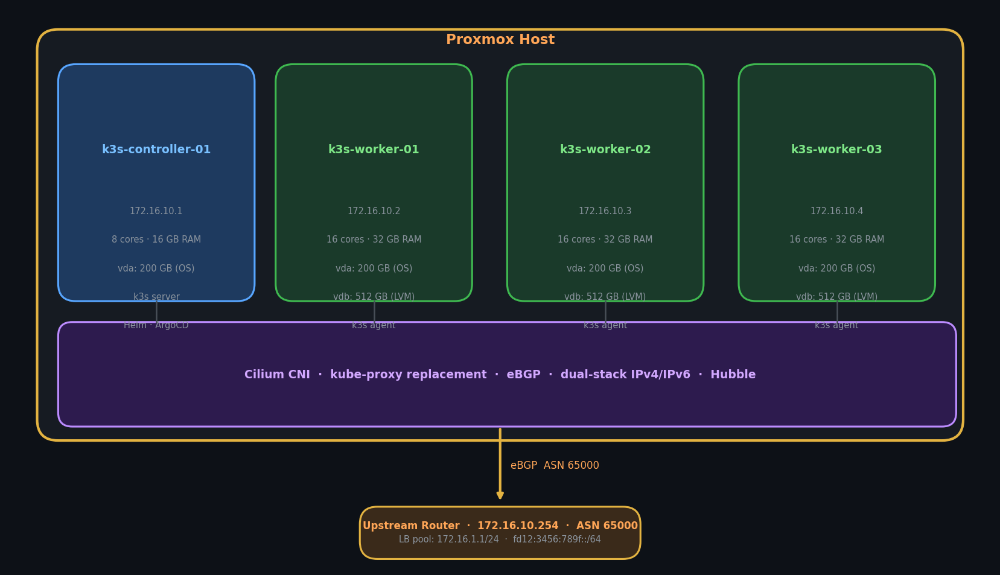
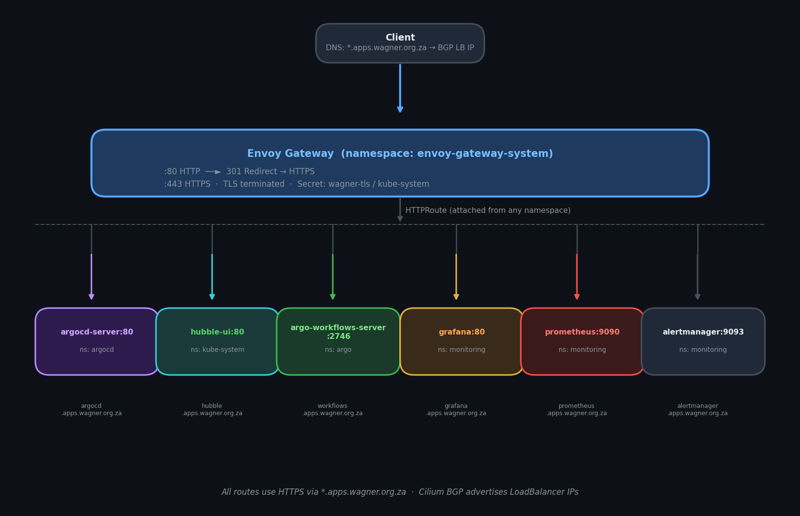
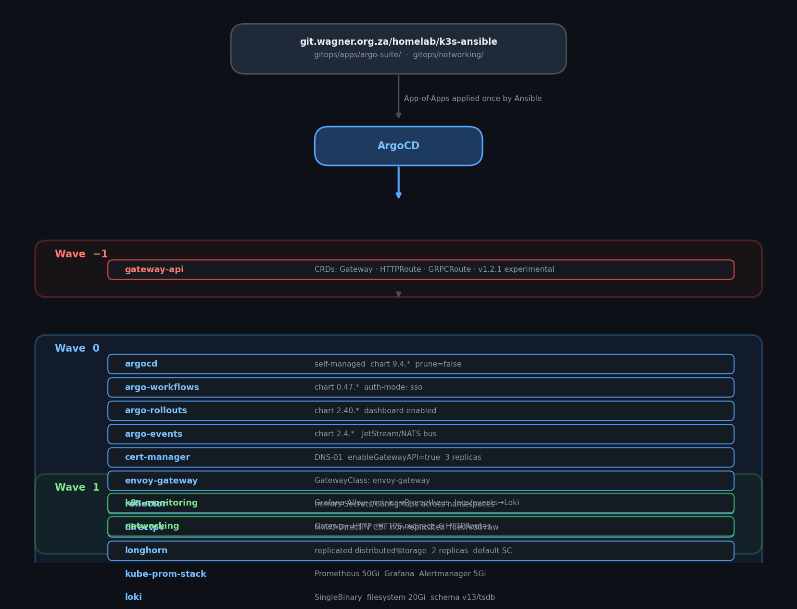
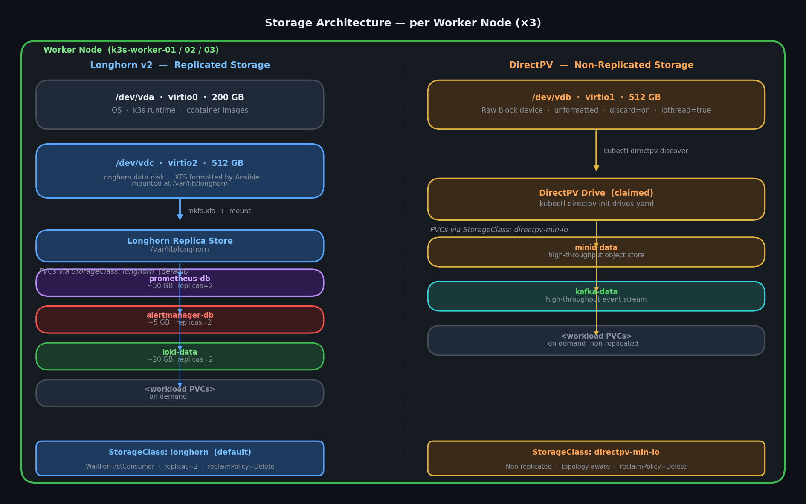
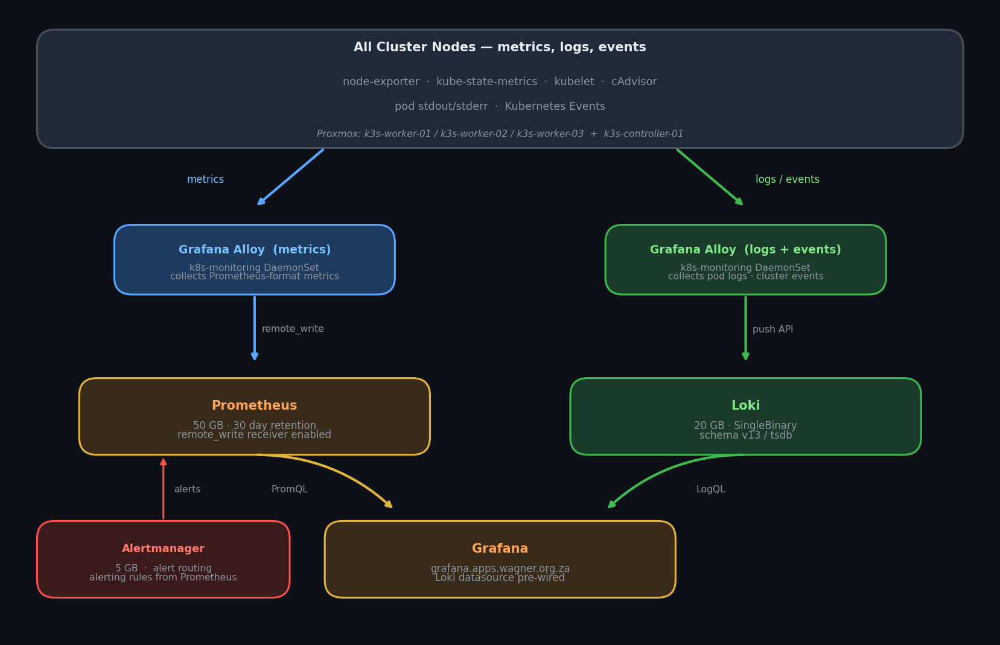

# README.md

## Project Purpose

IaC stack for a 4-node k3s Kubernetes cluster on Proxmox, using:
- **Terraform** (`bpg/proxmox ~> 0.70`) to provision Debian 13 VMs with cloud-init
- **Ansible** to configure nodes, install k3s, deploy Cilium CNI, and bootstrap ArgoCD
- **Cilium** as CNI with kube-proxy replacement, eBGP, and Hubble
- **ArgoCD** for GitOps — manages the full Argo suite + cluster infrastructure
- **DirectPV** for non-replicated, high-performance local storage on worker nodes (`/dev/vdb`)
- **Longhorn** for replicated distributed block storage across worker nodes
- **Full IPv4/IPv6 dual-stack** throughout

The `gradle.properties` file in the root is an IDE artifact and can be ignored.

---

## Architecture Diagrams

### Cluster Layout



```
┌──────────────────────────────────────────────────────────────────────────────┐
│  Proxmox Host                                                                │
│                                                                              │
│  ┌─────────────────┐  ┌───────────────┐  ┌───────────────┐  ┌────────────┐ │
│  │ k3s-controller  │  │ k3s-worker-01 │  │ k3s-worker-02 │  │k3s-worker  │ │
│  │ 172.16.10.1     │  │ 172.16.10.2   │  │ 172.16.10.3   │  │172.16.10.4 │ │
│  │ 8 cores / 16 GB │  │ 16c / 32 GB   │  │ 16c / 32 GB   │  │16c / 32 GB │ │
│  │ vda: 200 GB OS  │  │ vda: 200 GB   │  │ vda: 200 GB   │  │vda: 200 GB │ │
│  │                 │  │ vdb: 512 GB   │  │ vdb: 512 GB   │  │vdb: 512 GB │ │
│  │ k3s server      │  │ LVM (OpenEBS) │  │ LVM (OpenEBS) │  │LVM(OpenEBS)│ │
│  │ Helm / ArgoCD   │  │ k3s agent     │  │ k3s agent     │  │k3s agent   │ │
│  └────────┬────────┘  └──────┬────────┘  └──────┬────────┘  └─────┬──────┘ │
│           └─────────────────┴──────────────────┴────────────────┘         │
│                    Cilium CNI · eBGP · dual-stack · Hubble                  │
└──────────────────────────────────────────────────────────────────────────────┘
                │ BGP (eBGP, ASN 65000)
                ▼
        ┌───────────────────┐
        │   Upstream Router │  172.16.10.254 · ASN 65000
        │   Redistributes:  │  LB pool: 172.16.1.1/24
        │   pod CIDRs       │          fd12:3456:789f::/64
        └───────────────────┘
```

---

### Ingress / Traffic Flow



```
         Client
           │  DNS: *.apps.wagner.org.za → BGP-advertised LoadBalancer IP (172.16.1.x/24)
           ▼
  ┌─────────────────────────────────────────────────────────────────┐
  │  Envoy Gateway  (namespace: envoy-gateway-system)               │
  │                                                                 │
  │  :80  HTTP  ──────────────────────────► 301 → HTTPS            │
  │  :443 HTTPS · TLS terminated (Secret: wagner-tls / kube-system) │
  └──────────────────────────┬──────────────────────────────────────┘
                             │ HTTPRoute (attached from any namespace)
    ┌──────────┬─────────┬───┴──────┬──────────┬───────────┬──────────┐
    ▼          ▼         ▼          ▼          ▼           ▼          ▼
argocd-   hubble-ui  grafana  prometheus  alertmanager keycloak-svc:8080 longhorn
server:80   :80        :80      :9090        :9093    (sso.apps.wagner)   :80
 (argocd)(kube-sys)(monitoring)(monitoring)(monitoring)(keycloak)  (longhorn-sys)

```

---

### GitOps / Sync Wave Ordering



```
  git.wagner.org.za/homelab/k3s-ansible  (gitops/apps/argo-suite/)
           │
           │  App-of-Apps applied once by Ansible bootstrap
           ▼
       ┌────────┐
       │ ArgoCD │
       └───┬────┘
           │
    ┌──────▼──────────────────────────────────────────────┐
    │                    Wave -1                          │
    │  gateway-api  (CRDs: Gateway, HTTPRoute, GRPCRoute) │
    │  node-config  (node labels + controller taint)      │
    └──────┬──────────────────────────────────────────────┘
           │
    ┌──────▼──────────────────────────────────────────────┐
    │                    Wave 0                           │
    │  argocd           cert-manager     envoy-gateway    │
    │  reflector        longhorn         sealed-secrets   │
    │  cnpg             postgres                          │
    │  kube-prom-stack  loki             keycloak-operator│
    │  keycloak-config  barman-cloud                      │
    └──────┬──────────────────────────────────────────────┘
           │
    ┌──────▼──────────────────────────────────────────────┐
    │                    Wave 1                           │
    │  keycloak        (OIDC provider, depends on pgc1)   │
    │  k8s-monitoring  (Alloy → Prometheus + Loki)        │
    │  fluent-bit      (DaemonSet log collector → Loki)   │
    │  networking      (Gateway + all HTTPRoutes)          │
    └──────┬──────────────────────────────────────────────┘
           │
    └─────────────────────────────────────────────────────┘
```

---

### Storage Architecture (per worker node)



```
  Worker Node
  │
  ├── /dev/vda  (virtio0 · 200 GB) ── OS, k3s, container images
  │
  ├── /dev/vdb  (virtio1 · 512 GB) ── DirectPV data disk (raw, unformatted)
  │     │
  │     └── claimed by DirectPV after: kubectl directpv discover
  │                                     kubectl directpv init drives.yaml
  │           └── PVC via StorageClass: directpv-min-io  (non-replicated, local)
  │
  └── /dev/vdc  (virtio2 · 512 GB) ── Longhorn data disk
        │         formatted XFS · mounted at /var/lib/longhorn by Ansible
        └── PVC via StorageClass: longhorn  (replicated, 2 replicas, default)

  StorageClasses:
    longhorn       (default)  replicas=2  · WaitForFirstConsumer  · /var/lib/longhorn
    directpv-min-io           non-replicated · raw disk · topology-aware
```

---

### Monitoring Data Flow



```
  ┌────────────────────────────────────────────────────────────────┐
  │  All Nodes — metrics, logs, events                             │
  │                                                                │
  │  node-exporter · kube-state-metrics · kubelet · cAdvisor      │
  │  pod stdout/stderr logs · Kubernetes events                    │
  └──────┬─────────────────────┬──────────────────────────────────┘
         │                     │
         ▼                     ▼
  ┌─────────────┐      ┌──────────────────┐
  │ Alloy       │      │ Alloy            │
  │ (metrics)   │      │ (logs + events)  │
  └──────┬──────┘      └────────┬─────────┘
         │                      │
         │ remote_write         │ push API
         ▼                      ▼
  ┌─────────────┐      ┌──────────────────┐
  │ Prometheus  │      │      Loki        │
  │  50 GB/30d  │      │     20 GB        │
  └──────┬──────┘      └────────┬─────────┘
         └──────────┬───────────┘
                    ▼
             ┌─────────────┐
             │   Grafana   │  grafana.apps.wagner.org.za
             │             │  + Loki datasource pre-wired
             └─────────────┘
```

---

## Repository Structure

```
k3s-ansible/
├── infra/terraform/
│   ├── providers.tf              # bpg/proxmox provider + SSH
│   ├── variables.tf              # all input variables with defaults
│   ├── main.tf                   # controller VM + worker VMs (count=3, 2 disks each)
│   ├── outputs.tf                # IPs + rendered Ansible inventory block
│   └── terraform.tfvars.example  # copy to terraform.tfvars and fill in
├── scripts/
│   └── create-template.sh        # Run ON Proxmox: downloads Debian 13,
│                                 # creates cloud-init template VM
├── inventory/
│   ├── hosts.yml                 # node IPs (IPv4 + IPv6)
│   ├── group_vars/
│   │   ├── all.yml               # k3s, CIDRs, BGP, Cilium, OpenEBS, ArgoCD versions
│   │   ├── k3s_controller.yml    # API port, TLS SANs, kubeconfig path
│   │   └── k3s_workers.yml       # node labels
│   └── roles/                    # ALL Ansible roles live here (roles_path = inventory/roles)
│       ├── common/               # packages, kernel modules, sysctl, swap, Longhorn disk, /etc/hosts
│       ├── k3s_server/           # k3s server install + kubeconfig fetch
│       ├── k3s_agent/            # k3s agent install
│       ├── cilium/               # Helm install, BGP policy, LB IP pool
│       └── argocd/               # ArgoCD Helm bootstrap + App-of-Apps
├── gitops/
│   ├── apps/
│   │   ├── argo-suite/           # ArgoCD Application manifests (synced by ArgoCD)
│   │   │   ├── argocd-app.yaml               # ArgoCD self-management (prune=false, OIDC→Keycloak)
│   │   │   ├── cert-manager-app.yaml         # cert-manager (DNS-01, Gateway API)
│   │   │   ├── gateway-api-app.yaml          # Gateway API CRDs (sync-wave -1)
│   │   │   ├── envoy-gateway-app.yaml        # Envoy Gateway implementation
│   │   │   ├── reflector-app.yaml            # Secret/ConfigMap cross-namespace mirroring
│   │   │   ├── sealed-secrets-app.yaml       # Bitnami Sealed Secrets controller (kube-system)
│   │   │   ├── longhorn-app.yaml             # Longhorn replicated storage (default StorageClass)
│   │   │   ├── cnpg-app.yaml                 # CloudNativePG operator
│   │   │   ├── postgres-app.yaml             # Shared pgc1 cluster + databases (wave 0)
│   │   │   ├── barman-cloud-app.yaml         # Barman Cloud plugin for CNPG backups
│   │   │   ├── kube-prometheus-stack-app.yaml # Prometheus, Grafana, Alertmanager
│   │   │   ├── loki-app.yaml                 # Loki log aggregation (SingleBinary)
│   │   │   ├── fluent-bit-app.yaml           # Fluent Bit DaemonSet → Loki
│   │   │   ├── k8s-monitoring-app.yaml       # Grafana Alloy collectors (sync-wave 1)
│   │   │   ├── keycloak-operator-app.yaml    # Official Keycloak Operator CRDs + controller (wave 0)
│   │   │   ├── keycloak-config-app.yaml      # Keycloak secrets + SSO credentials (wave 0)
│   │   │   ├── keycloak-app.yaml             # Keycloak CR via official operator (wave 1)
│   │   │   ├── secrets-app.yaml              # Cluster-wide secrets (cloudflare token, dbcreds)
│   │   │   └── networking-app.yaml           # Gateway + HTTP→HTTPS redirect (sync-wave 1)
│   │   ├── node-config/          # Node labels and taints (managed by node-config-app, wave -1)
│   │   │   ├── rbac.yaml                     # ServiceAccount + ClusterRole for kubectl node patch
│   │   │   └── node-labels.yaml              # Sync hook Job: worker labels + controller NoExecute taint
│   │   ├── databases/
│   │   │   ├── postgres/         # Shared pgc1 PostgreSQL cluster (homelab namespace)
│   │   │   │   ├── cluster.yaml              # pgc1: 3-node, 100Gi directpv, PG18, WAL→MinIO
│   │   │   │   ├── databases.yaml            # CNPG Database CRDs (keycloak)
│   │   │   │   ├── backup.yaml               # ScheduledBackup daily via barman-cloud
│   │   │   │   ├── objectStore.yaml          # blobstorage-nas → MinIO (blob_storage_endpoint)
│   │   │   │   └── kustomization.yaml        # includes cluster, databases, backup, objectStore
│   │   ├── keycloak/             # Keycloak secrets (managed by keycloak-config-app, wave 0)
│   │   │   ├── postgres-secret.yaml          # keycloak DB credentials (keycloak ns)
│   │   │   ├── admin-secret.yaml             # Keycloak admin console credentials
│   │   │   └── grafana-sso-secret.yaml       # OIDC client secret (namespace: monitoring)
│   │   ├── keycloak-instance/    # Keycloak CR (managed by keycloak-app, wave 1)
│   │   │   ├── keycloak-cr.yaml              # Keycloak CR (k8s.keycloak.org/v2alpha1)
│   │   │   └── themes/                       # Custom login themes (ebucks, wagner)
│   │   └── secrets/              # Cluster-wide secrets (managed by secrets-app)
│   │       ├── cloudflare-token-secret.yaml  # cert-manager DNS-01 Cloudflare API token
│   │       ├── dbcreds.yaml                  # Shared DB credentials + blobstorage keys
│   │       └── letsencrypt.yaml              # ClusterIssuer for Let's Encrypt DNS-01
│   └── networking/
│       ├── gateway.yaml                  # Gateway resource (HTTP :80 + HTTPS :443, wagner-tls)
│       ├── gateway-class.yaml            # GatewayClass: envoy-gateway
│       ├── http-redirect.yaml            # HTTPRoute: HTTP → HTTPS 301 redirect
│       ├── hubble-route.yaml             # hubble.apps.wagner.org.za → hubble-ui:80
│       ├── argocd-route.yaml             # argocd.apps.wagner.org.za → argocd-server:80
│       ├── keycloak-route.yaml           # sso.apps.wagner.org.za → keycloak-service:8080
│       ├── grafana-route.yaml            # grafana / prometheus / alertmanager routes
│       ├── longhorn-frontend-route.yaml  # longhorn.apps.wagner.org.za → longhorn-frontend:80
│       ├── wagner-tls.yaml               # TLS certificate for *.apps.wagner.org.za
│       └── coredns-custom.yaml           # CoreDNS custom overrides (currently empty)
├── ansible.cfg
├── site.yml                      # ordered: common → k3s_server → cilium → k3s_agent → argocd
└── reset.yml                     # teardown: agents first, then server
```

---

## Prerequisites

1. **Debian 13 cloud-init template on Proxmox** — run `scripts/create-template.sh` on the
   Proxmox host before `terraform apply`. Set `TEMPLATE_VM_ID` env var if you want a custom ID.
2. **Proxmox API token** — create a token with `VM.Allocate`, `VM.Clone`, `VM.Config.*`,
   `Datastore.AllocateSpace`, `SDN.Use` permissions.
3. **BGP router** — your upstream router/firewall must be configured to accept eBGP sessions
   from the cluster nodes and peer on the address in `bgp_router_address`.
4. **SSH agent** — the bpg provider uses SSH for cloud-init; run `ssh-add` before `terraform apply`.
5. **Git repository** — run `scripts/setup.sh`; it writes `inventory/group_vars/all.yml` with
   the correct `gitops_repo_url` (and credentials for private repos).

---

## Deployment Playbook

Complete ordered procedure for a fresh cluster deployment. Run each phase in sequence.
To resume from a specific phase after a failure: `./scripts/post-deploy.sh --from=<phase>`.

### Phase 0 — Prepare (one-time local setup)

```bash
# 1. Create Proxmox VM template (run ON the Proxmox host)
scp scripts/create-template.sh root@proxmox:/tmp/
ssh root@proxmox bash /tmp/create-template.sh

# 2. Configure everything interactively (also writes cluster.env with secrets)
./scripts/setup.sh
# Generates: infra/terraform/terraform.tfvars, inventory/hosts.yml,
#            inventory/group_vars/all.yml, gitops/cilium/values.yaml,
#            cluster.env  (gitignored — contains all secrets)

# 3. Substitute {{ VAR_NAME }} tokens in gitops YAML files from cluster.env
bash scripts/apply-vars.sh
# Replaces tokens in: all secret files, objectStore.yaml, backup.yaml,
#                     postgres/cluster.yaml, kube-prometheus-stack-app.yaml

# 4. Commit the generated config files (secrets not yet sealed)
git add inventory/ infra/terraform/terraform.tfvars gitops/cilium/
git commit -m "Initial cluster configuration"
git push
```

### Phase 1 — Provision VMs (Terraform)

```bash
cd infra/terraform
terraform init
terraform plan      # review
terraform apply     # creates 4 VMs with cloud-init
cd ../..
```

### Phase 2 — Bootstrap cluster (Ansible)

```bash
# Add SSH key to agent
ssh-add ~/.ssh/id_rsa

# Run full playbook (common → k3s_server → cilium → k3s_agent → argocd)
ansible-playbook -i inventory/hosts.yml site.yml

# Verify kubeconfig
export KUBECONFIG=~/.kube/k3s.yaml
kubectl get nodes
```

### Phase 3 — Post-deploy automation

```bash
# Run the full post-deploy orchestration (phases 1–8)
./scripts/post-deploy.sh

# Or step through individually:
./scripts/post-deploy.sh --from=1-argocd    # wait for ArgoCD
./scripts/post-deploy.sh --from=2-secrets   # seal secrets
./scripts/post-deploy.sh --from=3-wave0     # wait for infrastructure
./scripts/post-deploy.sh --from=4-directpv  # init DirectPV drives
./scripts/post-deploy.sh --from=5-wave1     # wait for apps
./scripts/post-deploy.sh --from=6-keycloak  # bootstrap Keycloak
./scripts/post-deploy.sh --from=7-oidc      # seal + apply OIDC secrets
./scripts/post-deploy.sh --from=8-verify    # final health check
```

### Phase 4 — Manual post-deploy steps (after scripts complete)

These cannot be fully automated and must be done once:

1. **Back up sealed-secrets master key** (store offline, never in git):
   ```bash
   kubectl get secret -n kube-system \
     -l sealedsecrets.bitnami.com/sealed-secrets-key \
     -o yaml > ~/sealed-secrets-master-key.yaml
   ```

2. **Uptime Kuma** — visit `https://uptime.apps.wagner.org.za` and create the first admin account

3. **DirectPV verify** (should be done by post-deploy, but sanity check):
   ```bash
   kubectl directpv list drives
   ```

### Scripts reference

| Script | Purpose |
|--------|---------|
| `scripts/setup.sh` | Interactive config wizard — generates all config files + `cluster.env` |
| `scripts/apply-vars.sh` | Substitutes `{{ VAR_NAME }}` tokens in gitops YAMLs from `cluster.env` |
| `scripts/seal-secrets.sh` | Converts plaintext secrets to SealedSecrets (run after apply-vars) |
| `scripts/create-template.sh` | Creates Proxmox Debian 13 cloud-init template (run on Proxmox) |
| `scripts/post-deploy.sh` | Main post-deploy orchestration (8 phases) |
| `scripts/setup-keycloak.sh` | Creates Keycloak realm, clients, groups via REST API |
| `scripts/patch-oidc-secrets.sh` | Seals and applies OIDC client secrets from Keycloak |
| `scripts/init-directpv.sh` | Discovers and initialises DirectPV drives on workers |

---

## Terraform Workflow

```bash
cd infra/terraform

# First time
cp terraform.tfvars.example terraform.tfvars
# Edit terraform.tfvars with your Proxmox endpoint, token, SSH key, IPs, etc.

terraform init
terraform plan
terraform apply

# After apply, copy the rendered inventory from the output:
terraform output -raw ansible_inventory
```

### Worker VM disks
Each worker gets three virtio disks:
| Interface | Variable | Default | Purpose |
|-----------|----------|---------|---------|
| `virtio0` | `disk_gb` | 200 GB | OS + container images |
| `virtio1` | `data_disk_gb` | 512 GB | DirectPV raw disk (`/dev/vdb`) |
| `virtio2` | `longhorn_disk_gb` | 512 GB | Longhorn data disk, XFS (`/dev/vdc`) |

All disks have `discard = on` and `iothread = true` for SSD performance.

Key variables in `terraform.tfvars`:
- `proxmox_endpoint` / `proxmox_api_token` — Proxmox API access
- `controller` / `workers` — VM sizing, IP addressing, and disk sizes
- `ipv4_gateway` / `ipv6_gateway` — default routes injected via cloud-init

---

## Ansible Workflow

### Key variables (`inventory/group_vars/all.yml`)
| Variable | Description |
|----------|-------------|
| `k3s_version` | k3s release to install |
| `cluster_pod_cidr_v4/v6` | Pod CIDRs |
| `cluster_svc_cidr_v4/v6` | Service CIDRs |
| `bgp_router_address` | Upstream BGP peer IP |
| `bgp_router_asn` / `bgp_cluster_asn` | BGP ASNs |
| `lb_ip_pool_v4/v6` | LB service IP pools (BGP-advertised) |
| `cilium_version` | Cilium Helm chart version |
| `argocd_chart_version` | ArgoCD Helm chart version |
| `argocd_namespace` | Namespace for ArgoCD (default: `argocd`) |
| `gitops_repo_url` | **Must set** — URL of this git repo for ArgoCD App-of-Apps |
| `gitops_repo_revision` | Branch/tag ArgoCD tracks (default: `HEAD`) |

### Play order (`site.yml`)
1. `common` — all nodes: packages, kernel modules, sysctl, swap, /etc/hosts; workers: Longhorn disk format + mount
2. `k3s_server` — controller: install k3s server, fetch kubeconfig
3. `cilium` — controller: Helm install Cilium, BGP policy, LB pool
4. `k3s_agent` — workers: join cluster
5. `argocd` — controller: Helm install ArgoCD, apply App-of-Apps

### Common Commands

Run full site playbook:
```bash
ansible-playbook -i inventory/hosts.yml site.yml
```

Run with specific tags:
```bash
ansible-playbook -i inventory/hosts.yml site.yml --tags common
ansible-playbook -i inventory/hosts.yml site.yml --tags k3s_server
ansible-playbook -i inventory/hosts.yml site.yml --tags cilium
ansible-playbook -i inventory/hosts.yml site.yml --tags k3s_agent
ansible-playbook -i inventory/hosts.yml site.yml --tags argocd
```

Run with a node limit:
```bash
ansible-playbook -i inventory/hosts.yml site.yml --limit k3s_workers
```

Dry-run (check mode):
```bash
ansible-playbook -i inventory/hosts.yml site.yml --check --diff
```

Lint playbooks:
```bash
ansible-lint
```

Check inventory:
```bash
ansible-inventory -i inventory/hosts.yml --list
```

Teardown cluster:
```bash
ansible-playbook -i inventory/hosts.yml reset.yml
```

---

## GitOps / ArgoCD

### Bootstrap flow
1. Ansible installs ArgoCD via Helm on the controller (`inventory/roles/argocd/`)
2. Ansible renders and applies the `argo-suite` App-of-Apps (template: `inventory/roles/argocd/templates/app-of-apps.yaml.j2`)
3. ArgoCD syncs `gitops/apps/argo-suite/` and deploys all applications below

### Application sync waves
| Wave | Application | Notes |
|------|-------------|-------|
| `-1` | `gateway-api` | Gateway API CRDs — must exist before Envoy Gateway and cert-manager |
| `0` | `argocd` | Self-managed ArgoCD Helm release; OIDC configured against Keycloak |
| `0` | `cert-manager` | DNS-01, Gateway API enabled, 3 replicas |
| `0` | `envoy-gateway` | Gateway API implementation (GatewayClass: `envoy-gateway`) |
| `0` | `reflector` | Mirrors Secrets/ConfigMaps across namespaces |
| `0` | `sealed-secrets` | Bitnami Sealed Secrets controller (namespace: `kube-system`) |
| `0` | `cnpg` | CloudNativePG operator (must precede postgres app) |
| `0` | `postgres` | Shared pgc1 cluster + Database CRDs (keycloak) + barman-cloud backup |
| `0` | `longhorn` | Distributed replicated block storage v2 (default StorageClass, 2 replicas) |
| `0` | `kube-prometheus-stack` | Prometheus (50Gi), Grafana (SSO via Keycloak), Alertmanager (5Gi), node-exporter, kube-state-metrics |
| `0` | `loki` | Log aggregation, SingleBinary mode, filesystem (20Gi), schema v13/tsdb |
| `0` | `keycloak-operator` | Official Keycloak Operator CRDs + controller from `keycloak/keycloak-k8s-resources` |
| `0` | `keycloak-config` | Keycloak secrets: admin credentials, DB password, `grafana-oauth-secret` |
| `0` | `barman-cloud` | Barman Cloud plugin for CNPG WAL archiving to MinIO |
| `1` | `keycloak` | Keycloak CR via official operator; URL `sso.apps.wagner.org.za`; realm `homelab`, clients: `argocd`, `grafana` |
| `1` | `k8s-monitoring` | Grafana Alloy: ships metrics, pod logs, cluster events to Prometheus + Loki |
| `1` | `fluent-bit` | DaemonSet; tails container logs → Loki |
| `1` | `networking` | Shared Gateway + HTTP→HTTPS redirect + all HTTPRoutes |

### Storage
Two StorageClasses are deployed, serving different needs:

| StorageClass | Driver | Type | Replicas | Best for |
|---|---|---|---|---|
| `longhorn` (default) | Longhorn | Replicated distributed | 2 | General workloads, databases needing HA |
| `directpv-min-io` | DirectPV | Non-replicated local | 1 | High-throughput workloads (MinIO, Kafka) |

**Longhorn**
- Replication across all 3 worker nodes (2 replicas configured — survives one node failure)
- Data path: `/var/lib/longhorn` on a **dedicated 512 GB XFS disk** (`/dev/vdc`, virtio2)
- Ansible `common` role formats `/dev/vdc` as XFS and mounts it at `/var/lib/longhorn`
- Default StorageClass; `WaitForFirstConsumer` binding
- RWX volumes supported (requires `nfs-common`, installed by Ansible)

**DirectPV**
- Raw block device `/dev/vdb` (512 GB virtio1 disk) on each worker
- No pre-formatting needed — Ansible leaves the disk raw
- After ArgoCD deploys the CSI driver, an admin must initialise drives once:
  ```bash
  kubectl directpv discover
  kubectl directpv init drives.yaml
  ```
- Disk layout per worker: `virtio0` = OS (200 GB), `virtio1` = DirectPV raw (512 GB), `virtio2` = Longhorn XFS (512 GB)

### Shared Gateway (`gitops/networking/`)
- **Gateway** named `gateway` in `kube-system`, GatewayClass `envoy-gateway`
- Pinned LoadBalancer IP: `172.16.1.1` (via `lbipam.cilium.io/ips` on `spec.infrastructure.annotations`)
- HTTP listener (:80) — all routes redirect to HTTPS via `http-to-https-redirect` HTTPRoute
- HTTPS listener (:443) — terminates TLS using Secret `wagner-tls` in `kube-system`
- Both listeners allow routes from **all namespaces**
- HTTPRoutes are placed in the **same namespace as their backend service** (no ReferenceGrant needed)

### CoreDNS custom overrides (`gitops/networking/coredns-custom.yaml`)
The ConfigMap exists but is empty (`data: {}`). All services route through the shared Envoy Gateway and are covered by the wildcard `*.apps.wagner.org.za` DNS record — no static CoreDNS overrides are needed. k3s CoreDNS mounts it from `kube-system` at `/etc/coredns/custom/` and imports `*.override` files automatically.

To force a CoreDNS reload after any future changes:
```bash
kubectl rollout restart deploy/coredns -n kube-system
```

### Exposed services
| Hostname | Backend | Namespace |
|----------|---------|-----------|
| `argocd.apps.wagner.org.za` | `argocd-server:80` | `argocd` |
| `hubble.apps.wagner.org.za` | `hubble-ui:80` | `kube-system` |
| `grafana.apps.wagner.org.za` | `kube-prometheus-stack-grafana:80` | `monitoring` |
| `prometheus.apps.wagner.org.za` | `kube-prometheus-stack-prometheus:9090` | `monitoring` |
| `alertmanager.apps.wagner.org.za` | `kube-prometheus-stack-alertmanager:9093` | `monitoring` |
| `longhorn.apps.wagner.org.za` | `longhorn-frontend:80` | `longhorn-system` |
| `sso.apps.wagner.org.za` | `keycloak-service:8080` | `keycloak` |

### ArgoCD access
```bash
# Port-forward the UI (before Gateway is ready)
kubectl port-forward svc/argocd-server -n argocd 8080:443

# Admin password (saved by Ansible)
cat ~/.argocd-admin-password
```

### Keycloak SSO
Keycloak is the OIDC provider for ArgoCD and Grafana. Deployed via the **official Keycloak Operator** (`keycloak-operator-app`, wave 0), with the Keycloak CR in `gitops/apps/keycloak-instance/` (`keycloak-app`, wave 1). The operator creates a service named `keycloak-service` on port 8080; traffic reaches it at `https://sso.apps.wagner.org.za` via the Envoy Gateway HTTPRoute.

**Post-deploy setup (run once after Keycloak is healthy):**
1. Log in at `https://sso.apps.wagner.org.za` with admin credentials
2. Create realm: `homelab`
3. Create group `admins` → grants admin in ArgoCD and Grafana
4. Create client `argocd` (OpenID Connect, confidential)
   - Valid redirect URI: `https://argocd.apps.wagner.org.za/auth/callback`
   - Add group membership mapper: token claim name = `groups`, full path = off
   - Patch client secret:
     ```bash
     kubectl patch secret argocd-secret -n argocd \
       --patch='{"stringData":{"oidc.keycloak.clientSecret":"<secret>"}}'
     ```
5. Create client `grafana` (OpenID Connect, confidential)
   - Valid redirect URI: `https://grafana.apps.wagner.org.za/login/generic_oauth`
   - Patch client secret:
     ```bash
     kubectl patch secret grafana-oauth-secret -n monitoring \
       --patch='{"stringData":{"client-secret":"<secret>"}}'
     ```

**RBAC policy**:
- `admins` group → `role:admin` in ArgoCD; `Admin` role in Grafana
- ArgoCD default: `role:readonly`; Grafana default: `Viewer`

### Monitoring stack

| Component | Role | Storage | URL |
|-----------|------|---------|-----|
| Prometheus | Metrics scraping + storage | 50Gi DirectPV, 30d retention | `prometheus.apps.wagner.org.za` |
| Grafana | Dashboards; SSO via Keycloak; Loki datasource | — | `grafana.apps.wagner.org.za` |
| Alertmanager | Alert routing | 5Gi Longhorn | `alertmanager.apps.wagner.org.za` |
| Loki | Log aggregation (pod logs + events via Alloy) | 20Gi Longhorn | internal |
| Alloy | Metrics → Prometheus; pod logs + events → Loki | — | (DaemonSet) |
| Fluent Bit | Container logs → Loki | — | (DaemonSet) |
| Uptime Kuma | Uptime / status-page monitoring | MariaDB | `uptime.apps.wagner.org.za` |

**Log pipeline:**
```
┌─────────────────────────┐     ┌─────────────────────────┐
│  Alloy (DaemonSet)      │────▶│  Loki                   │
│  - pod stdout/stderr    │     │  (pod logs + events)    │
│  - k8s events           │     └─────────────────────────┘
└─────────────────────────┘
┌─────────────────────────┐     ┌─────────────────────────┐
│  Fluent Bit (DaemonSet) │────▶│  Loki                   │
│  - /var/log/containers/ │     │  (all container logs)   │
│    *.log                │     └─────────────────────────┘
└─────────────────────────┘
```

**Querying in Grafana (Loki):**
```logql
{namespace="keycloak"}               # all Keycloak logs
{job="fluent-bit"} |= "error"       # error lines across all pods
```

**Uptime Kuma post-deploy**: Browse to `https://uptime.apps.wagner.org.za` and create the first admin account on first visit.

### Database Architecture

#### Shared PostgreSQL (`pgc1`, namespace: `homelab`)
- 3-instance CNPG cluster, 100Gi on `directpv-min-io`, PostgreSQL 18 (trixie)
- Service: `pgc1-rw.homelab.svc.cluster.local:5432`
- WAL archiving to MinIO (`blob_storage_endpoint` from `inventory/group_vars/all.yml`) via barman-cloud plugin
- Managed roles and their secrets:

| Role | Secret (homelab ns) | Used by |
|------|---------------------|---------|
| `cw` | `dbcreds` | superuser / human admin |
| `keycloak` | `dbcreds-keycloak` | Keycloak |

### Adding new ArgoCD applications
Drop a new `*-app.yaml` in `gitops/apps/argo-suite/` and commit — ArgoCD will pick it up
automatically on the next sync (automated sync is enabled). Use `argocd.argoproj.io/sync-wave`
annotations to control ordering relative to existing apps.

---

## BGP Router Requirements

Your upstream router must:
- Accept eBGP sessions from all cluster node IPs
- Advertise a default route (or the relevant prefixes) back to the cluster
- Allow the pod CIDRs (`10.42.0.0/16`, `fd00:42::/48`) to be propagated
- The LB IP pools will be announced by Cilium for `LoadBalancer` services

---

## Secrets Management (Sealed Secrets)

All Kubernetes `Secret` objects in this repo are encrypted with **Bitnami Sealed Secrets**.
Encrypted `SealedSecret` CRs are safe to commit to git. The in-cluster controller holds the
master key and materialises the real `Secret` from each `SealedSecret` automatically.

### How it works
```
SealedSecret (in git) → sealed-secrets-controller → Secret (in cluster)
```
- The controller is deployed by ArgoCD (`gitops/apps/argo-suite/sealed-secrets-app.yaml`, wave 0, `kube-system`)
- Encryption uses the cluster's RSA public key — only that cluster can decrypt
- **Back up the master key** — without it you cannot re-seal or recover secrets after a cluster rebuild

### Initial setup / first seal

Secret files in this repo contain `{{ VAR_NAME }}` tokens rather than real values.
Before sealing you must substitute real values from `cluster.env`:

```bash
# 1. Fill in secrets (setup.sh does this automatically; or edit manually)
cp cluster.env.example cluster.env
$EDITOR cluster.env

# 2. Substitute tokens into gitops YAML files
bash scripts/apply-vars.sh

# 3. Install kubeseal CLI (macOS)
brew install kubeseal

# 4. Wait for the controller to be running
kubectl get deploy -n kube-system sealed-secrets-controller

# 5. Seal all plaintext secrets (backs up originals to .bak)
./scripts/seal-secrets.sh

# 6. Verify ArgoCD syncs cleanly, then delete backups and commit
git add gitops/
git commit -m "Encrypt all secrets with sealed-secrets"
```

### Back up the master key (run once, store out of git)

```bash
kubectl get secret -n kube-system \
  -l sealedsecrets.bitnami.com/sealed-secrets-key \
  -o yaml > sealed-secrets-master-key.yaml
```

Keep `sealed-secrets-master-key.yaml` in a password manager or offline store — **never commit it**.

### Sealing a new secret

```bash
# Fetch the cluster public cert once (or on each new cluster)
kubeseal --fetch-cert \
  --controller-name=sealed-secrets-controller \
  --controller-namespace=kube-system > pub-cert.pem

# Seal a secret
kubeseal --format yaml --cert pub-cert.pem < my-secret.yaml > my-sealed-secret.yaml
```

### Secrets in this repo

| File | Namespace | Purpose |
|------|-----------|---------|
| `gitops/apps/keycloak/admin-secret.yaml` | keycloak | Keycloak admin credentials |
| `gitops/apps/keycloak/postgres-secret.yaml` | keycloak | Keycloak DB credentials |
| `gitops/apps/keycloak/grafana-sso-secret.yaml` | monitoring | Grafana OIDC secret |
| `gitops/apps/keycloak-instance/gitea-readonly-secret.yaml` | keycloak | Gitea read-only token for theme-loader |
| `gitops/apps/databases/postgres/objectStore.yaml` | postgres | MinIO blobstorage credentials (barman-cloud) |
| `gitops/apps/secrets/cloudflare-token-secret.yaml` | cert-manager | Cloudflare API token for DNS-01 |
| `gitops/apps/secrets/dbcreds.yaml` | postgres | Postgres superuser + blobstorage credentials |

---

## Notes

- **Roles path**: all Ansible roles live in `inventory/roles/` — `ansible.cfg` sets
  `roles_path = inventory/roles`. Do not create roles in the top-level `roles/` directory.
- The k3s cluster token is generated on first run and stored in `~/.k3s_token` on the
  Ansible control machine. Keep this file safe — it's needed to add more nodes later.
- The kubeconfig is fetched to `~/.kube/k3s.yaml`; set `KUBECONFIG=~/.kube/k3s.yaml` or
  merge it into `~/.kube/config` to use `kubectl` locally.
- `traefik` and `servicelb` (klipper-lb) are disabled in the k3s config — use Cilium's
  BGP-advertised LB pool for `LoadBalancer` services instead.
- The `wagner-tls` Secret must exist in `kube-system` for the Gateway to become ready.
  Use cert-manager to issue it and Reflector to mirror it if issued in another namespace.
- All `kubectl` commands in Ansible roles use `k3s kubectl` and
  `KUBECONFIG: /etc/rancher/k3s/k3s.yaml` to avoid depending on a separately installed kubectl.
- **Worker disks**: `virtio0` = OS (200 GB), `virtio1` = DirectPV raw (512 GB, `/dev/vdb`), `virtio2` = Longhorn XFS (512 GB, `/dev/vdc`)
- **DirectPV disk** (`/dev/vdb`) is left **raw/unformatted** by Ansible. Do not pre-format.
  After deployment: `kubectl directpv discover && kubectl directpv init drives.yaml`
- **Longhorn disk** (`/dev/vdc`) is formatted as XFS and mounted at `/var/lib/longhorn` by
  the Ansible `common` role during provisioning. Longhorn uses this as its dedicated data path.
